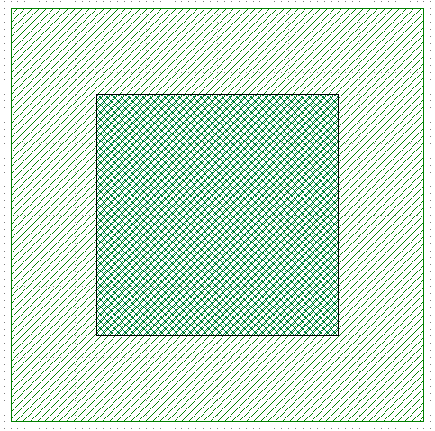
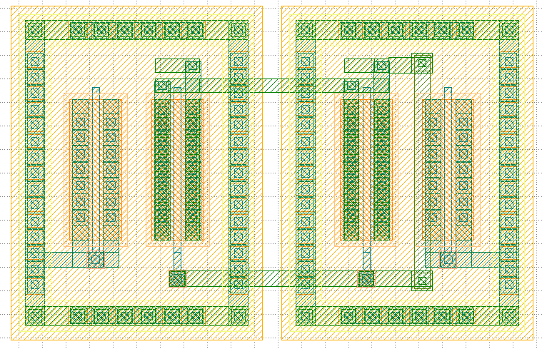
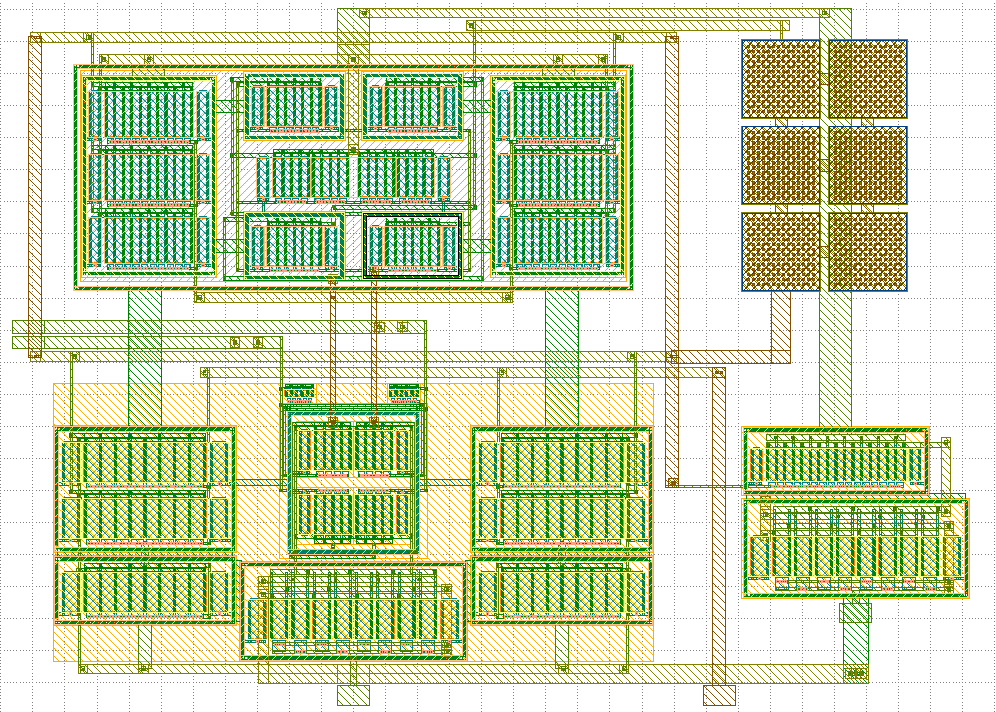

# SSCS “PICO” Open-Source Chipathon 
**Note:** Chipathon 2024 contributions will be made directly to the OpenFASOC/GLAYOUT [Repository](https://github.com/idea-fasoc/OpenFASOC) using the layout automation tool - GLayout. Tapeout-ready designs will be pushed to this repo with their final simulations results.

## Index 
1. [Quick Links](#quick-links)
2. [Introduction](#introduction)
3. [Installation](#installation)
4. [How to use Glayout](#how-to-use-glayout)

## Quick Links 
1. [Glayout Installation Guide](https://docs.google.com/document/d/161Pstk6R0ECvJJNA-SJqtLt_VpfH_s84sYTyvpQQbl8/edit?usp=sharing)
2. [Glayout Introduction Guide](https://docs.google.com/document/d/1vdw3_tFQGgvZGH7e2K7p9UVJA92clISRoUobgk_HHyo/edit?usp=sharing)
3. [Glayout Videos](https://www.youtube.com/@OpenFASOC) (links to the OpenFASOC youtube, all introductory videos can be found here)
4. [Prospective PCells](https://docs.google.com/spreadsheets/d/12O-WoqSlHhPshN3-2ph_LZLXPteRHmBOlMnybfmNyzg/edit?usp=sharing)
5. [Pcell Notebooks](https://github.com/idea-fasoc/OpenFASOC/tree/7dc5eb42cec94c02b74e72483df6fdc2b2603fb9/docs/source/notebooks/glayout)

## Introduction 
The IEEE Solid-State Circuits Society is pleased to announce its third open-source integrated circuit (IC) design contest under the umbrella of its [PICO](https://sscs.ieee.org/about/solid-state-circuits-directions/sscs-pico-program) Program (Platform for IC Design Outreach). While this contest is open to any individual or team, we encourage the participation of pre-college students, undergraduates, and geographical regions that are underrepresented within the IC design community.

## Installation 
We have a detailed installation guide [here](https://docs.google.com/document/d/1vdw3_tFQGgvZGH7e2K7p9UVJA92clISRoUobgk_HHyo/edit#heading=h.7qf3y8j2h17c). This guide will help you set up the following: 
1. A python environment (version $\ge$ 3.10)
2. Conda packages with python 3.10  
a. [Magic](http://opencircuitdesign.com/magic/)  
b. [Netgen](http://opencircuitdesign.com/netgen/)  
c. [Yosys](https://yosyshq.net/yosys/)  
c. [OpenROAD](https://theopenroadproject.org/)  
d. [Open PDKs (GF180MCU and SKY130)](https://github.com/RTimothyEdwards/open_pdks)  
e. [NGSpice](http://ngspice.sourceforge.net/)  
f. [Klayout](https://www.klayout.de/)  
  
***Note: To test your installation, there is a script called `test_glayout.py` in the `openfasoc/generators/glayout`. Run this script to check if all the tools are installed correctly.***  

## How to use Glayout
A detailed introduction to Glayout and its codebase can be found [here](https://docs.google.com/document/d/161Pstk6R0ECvJJNA-SJqtLt_VpfH_s84sYTyvpQQbl8/edit#heading=h.qs32jgwr6ax). **It is recommended that all contributors read through the document to learn how to create pcells.**   
Some examples of pcells, with their generated layouts have been shown below (**refer to the links to see PCell code or Notebooks**).  

1. [Via](https://github.com/idea-fasoc/OpenFASOC/blob/7dc5eb42cec94c02b74e72483df6fdc2b2603fb9/docs/source/notebooks/glayout/GLayout_Via.ipynb)  
The notebook demonstrates how to place a rectangular via by using specified metal layers. This is the simplest pcell and a must know.  

  

2. [Current Mirror](https://github.com/idea-fasoc/OpenFASOC/blob/7dc5eb42cec94c02b74e72483df6fdc2b2603fb9/docs/source/notebooks/glayout/GLayout_Cmirror.ipynb)  
The notebook linked goes over the placement, movement and routing of 2 transistor current mirror. 

3. [Opamp](https://github.com/idea-fasoc/OpenFASOC/tree/7dc5eb42cec94c02b74e72483df6fdc2b2603fb9/openfasoc/generators/glayout/glayout/flow/blocks/opamp)  
This cell linked creates a two stage Operational Amplifier + an nfet output stage. The opamp uses a differential to single ended converter and a pmos load with miller compensation as the first two stages. A coaxial driver is also connected.  

