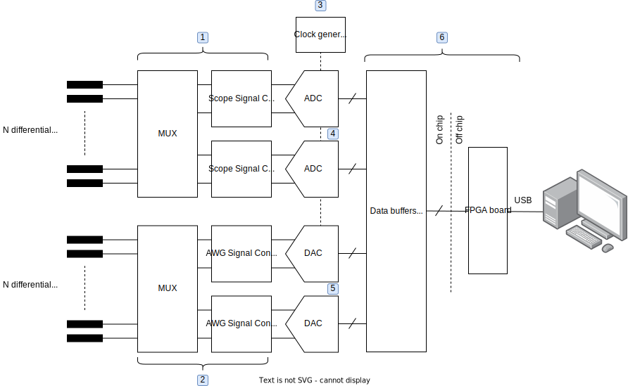

# Target specifications

The purpose of this page is to seed some ideas on what the  “lab bench on a chip” target design may look like. Further teamwork and thinking is required to turn this into a workable design that we can tape out toward the end of the year. Each participating team may choose to work on one or more of the six building blocks identified in the diagram below. The proposals submitted by each team (in the form of a Jupyter notebook) should describe in detail how you want to implement your chosen block(s), what the specifications will be, and in addition provide convincing calculations and simulation results. Layouts are not required at the proposal stage.

      

To our knowledge, there aren't any published prior-art “lab bench on a chip” designs that we can build on. However, we can draw some inspiration from a similar system that was designed for PCB measurements. The [Analog Discovery 2](https://digilent.com/reference/test-and-measurement/analog-discovery-2/start) is a multifunction instrument that has all the functionality we are looking for (and more) and comes with detailed [schematics](https://digilent.com/reference/test-and-measurement/analog-discovery-2/hardware-design-guide). While this documentation provides a first-order idea on what we should build, the circuit design style will be somewhat different for on-chip circuitry. Additionally, it will be difficult to match all specifications within a reasonable area budget and given the 180 nm technology that we have at our disposal.

Generally, think of this entire project as an experiment. We want to explore what a team of enthusiasts, spread across the globe, can do within the new environment of open-source IC design. Even if we don't succeed at building the complete target system in our first attempt, the community can re-use the various blocks that we design for future iterations or for an entirely different purpose.

What follows below are initial thoughts and baseline specs for each one of our major system components. All teams are encouraged to exceed these requirements and explore what is possible.

**1. Scope MUX and signal conditioning**  
The oscilloscope design should have an input MUX that allows the macro's user to switch the ADC resources to a number of different test points within the DUT. It is desirable to have the MUX work for rail-to-rail inputs. The signal conditioning circuitry should have a small input capacitance and essentially "infinite" input resistance. On the output side, there must be significant drive strength to handle the high-speed ADCs and deal with their charge kickback (if applicable). A plus for the signal conditioning block would be to include transimpedance stages for current measurements. The Analog Discovery 2 has adjustable offsets in each channel. This may not be needed for our design.

| Specification | Symbol | Baseline requirement | Comment |
| ------------- | ------ |--------------------- |-------- |
| Scope input capacitance | Cin | < 5pF | From each diff. input to ground
| Number of differential input channels   | N  |  $\geq8$  | For a future project, much larger N could be beneficial for enabling "tiny tapeouts" for analog circuits with many small blocks
| Programmable gain   | G  |  0.25, 0.5, 1, 2, 4, 8 | Gain <1 needed since ADC likely cannot handle rail-to-rail inputs
| Bandwidth   | BW  |  Maximize | Should be linked to ADC's acquisition bandwidth
| Noise   | Neq  |  <0.5 LSBrms | Contribution of the front-end to the ADC's sampled noise

**2. AWG MUX and signal conditioning**  
The arbitrary waveform generator design should have an output MUX that allows the macro's user to direct the DAC resources to a number of different test points within the DUT. It is desirable to have the MUX work for rail-to-rail outputs. The MUX resistance will limit the AWG drive strength, but this should be OK for small on-chip loads. The Analog Discovery 2 has adjustable offsets in each channel. This may not be needed for our design. 

| Specification | Symbol | Baseline requirement | Comment |
| ------------- | ------ |--------------------- |-------- |
| AWG load capacitance | CL | $\leq$ 10pF | Driver stability must be ensured up to this level
| Number of differential input channels   | N  |  $\geq8$  | For a future project, much larger N could be beneficial for enabling "tiny tapeouts" for analog circuits with many small blocks
| Bandwidth   | BW  |  Maximize | Should be linked to DAC's Nyquist bandwidth
| Slew rate   | SR  |  $\geq V_{peak}\cdot 2\pi BW$ | Align with bandwidth, assuming largest supported signal
| Output noise | PSD  |  <20nV/rt-Hz | 

**3. Clock generator**  
The clock generator(s) for both the ADC and DAC should be designed in alignment with the target specs for these converters. For example, the clock generator's jitter should not lead to a significant SNR degradation at the maximum input frequency.

**4. ADCs**  
The ADC and DAC design tasks will likely the most challenging and time consuming. An important objective is to minimize silicon area while still achieving attractive specs for the given application. Teams working on this block should consider re-using existing designs, as for instance this [12-bit SAR ADC](https://github.com/w32agobot/SKY130_SAR-ADC). It is desirable to have at least two ADCs (as shown in the system diagram) so that two signals can be measured simultaneously in real time, but this is not a must.

| Specification | Symbol | Baseline requirement | Comment |
| ------------- | ------ |--------------------- |-------- |
| Sampling rate | fs | $\geq$ 1.5MS/s | 
| Effective number of bits   | ENOB  |  $\geq9$  | Measured near Nyquist
| Input capacitance   | Cin  |  $\leq$ 5pF | 

**5. DACs**  
For the DAC, it may be best to aim for a current steering topology (also used in the Analog Discovery 2). Such a DAC will produce a differential output current that is converted to a differential voltage and image-filtered by the AWG signal conditioning block. Off the shelf current steering DACs are typically designed for high currents to interface with 50 Ohm loads. This is not a requirement in our on-chip environment; we can deviate to minimize circuit area. It is desirable to have at least two DACs (as shown in the system diagram) so that two signals can be generated simultaneously in real time, but this is not a must.

| Specification | Symbol | Baseline requirement | Comment |
| ------------- | ------ |--------------------- |-------- |
| Update rate | fs | $\geq$ 10MS/s | 
| Number of bits | B | $\geq$ 10 | 
| Intermodulation distortion   | IM3  |  $\geq$ -60dB  | Measured near Nyquist
| Noise spectral density   | NSD  |   |  To be aligned with overall PSD spec for the AWG path

**6. Digital interface**  
One of the primary goals here is to enable a convenient USB interface to a host computer. Teams working on this aspect should design both the on- and off-chip digital circuitry. For the external board, we can consider the lowest cost options from [Digilent](https://digilent.com/shop/boards-and-components/system-boards/introductory-boards/?sort=priceasc). The USB UART provided [here](https://github.com/ricynlee/cmod-a7-uart-sram-test) could be useful for establishing the communication.
